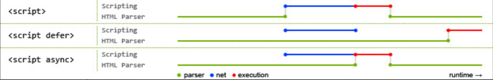

#### href和src的区别

href是指向网络资源所在位置，是异步加载的

src是同步加载的，只有将其指向的资源下载后才会继续执行

#### html语义化的理解

用正确的标签做正确的事，有利于搜索引擎爬取有效信息，并且有利于其他软件的读取---读屏软件，更容易的生成目录

对开发者友好，可读性更强，结构清晰

header nav section main article aside figure figction footer

#### DOCTYPE(⽂档类型) 的作⽤

添加文档声明以确保不同浏览器以相同的方式来解析，如果不声明或者错误的设置了DOCTYPE，则会出发怪异模式。

#### script标签中defer和async的区别

什么都不加，浏览器会直接加载并执行脚本，他不会等待后续文档，读取就开始执行，会阻塞了后续文档加载

defer和async属性都是异步加载js的脚本文件，<del>他们不会阻塞页面的解析</del>



#### 常⽤的meta标签有哪些

meta都由name和content描述

<meta charset="UTF-8">
告知网页编码

<meta name="keywords" content="关键词" />

用于网络爬虫爬取

<meta name="description" content="页面描述内容" />

网站的描述，在搜索引擎中详细信息中展示

#### HTML5有哪些更新

1. 语义化标签
2. 媒体标签
   1. 音频标签
   2. 视频标签
   3. 还有使用source来支持兼容性
3. 表单类型
   1. email
   2. url
   3. number
   4. week
   5. month
4. web存储
   1. localStorage
   2. sessionStorage
5. canvas和websocket

#### img的srcset属性的作⽤？

响应式页面种常用的属性，不同的屏幕密度加载不同的图片

```html

```

#### 行内元素有哪些？块级元素有哪些？ 空(void)元素有那些？

+ 行内元素：a b span input select strong
+ 块级元素：div ul ol li p h1-h6

[Web Worker 使用教程](https://www.ruanyifeng.com/blog/2018/07/web-worker.html)

web worker 是运行在后台的 js，不影响页面性能，

####  HTML5的离线储存怎么使用，它的工作原理是什么

#### 浏览器是如何对 HTML5 的离线储存资源进行管理和加载？

#### title与h1的区别、b与strong的区别、i与em的区别？

title表示为标题，h1表示为一级标题，b和strong都是加粗，但是strong语义更为明显，更为推荐。i是斜体，em为强调。他们是不同的语义

#### **iframe 有那些优点和缺点？**

#### label 的作用是什么？如何使用？

当用户点击label标签的时候，会自动聚焦到label对应的表单控件上

#### Canvas和SVG的区别

+ SVG：SVG可缩放矢量图形
+ Canvas：Canvas是画布，通过Javascript来绘制2D图形，是逐像素进行渲染的。

#### head 标签有什么作用，其中什么标签必不可少？

定义于浏览器头部，可以引入脚本，提供网页的必要信息。

常用的标签有<del>base</del>  link  meta script  style  title

title是必不可少的

#### 浏览器乱码的原因是什么？如何解决？

编解码不一样